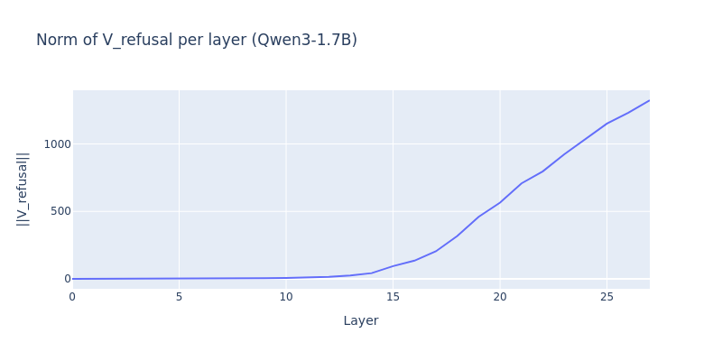
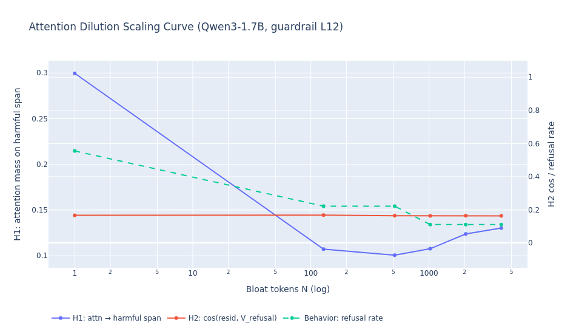

# Attention Dilution in Qwen3-1.7B

A mechanistic study of why long-context jailbreaks succeed: as benign context grows, the attention heads that mediate refusal physically lose attention mass on the harmful tokens, even though the refusal *direction* in the residual stream is unchanged.

## Motivation

Long-context language models are increasingly deployed in agentic and multi-turn settings where a harmful request may sit at the end of tens of thousands of benign tokens. A growing body of work (Anthropic's Many-Shot Jailbreaking, the "lost in the middle" literature) shows that safety-tuned models which reliably refuse a harmful request in isolation will comply with that same request once it is buried in enough surrounding context. This is a safety-relevant failure mode: the same RLHF-trained refusal behavior that passes red-team evaluations at short context silently degrades as context grows, and the degradation is invisible to standard benchmarks that test prompts in isolation.

This project asks a mechanistic question rather than a behavioral one. We already know jailbreaks work; we want to know **why**, at the level of attention heads and residual-stream directions. The hypothesis under test is that the model's internal "guardrail" circuitry — the small number of attention heads that mediate refusal — physically loses attention mass on the harmful tokens as benign context dilutes the softmax. If that is true, long-context jailbreaks are not a sophisticated semantic attack on the model's values; they are an arithmetic side effect of attention normalization, and the fix has to live inside the attention mechanism, not in the training data.

## Method

We follow Arditi et al. (2024) for the refusal direction and extend their framework to a context-length sweep.

**Phase 1 — extracting V_refusal.** On Qwen3-1.7B (28 layers, 16 heads, d_model=2048, 32K RoPE context), we run 32 paired harmful / harmless prompts and cache the residual stream at the last instruction-token position at every layer. The refusal direction at layer ℓ is the difference of class means:

```
V_refusal^(ℓ) = mean(h^(ℓ) | harmful) − mean(h^(ℓ) | harmless)
```

We pick the best layer by sweeping a directional-ablation hook (project out V_refusal at every residual-stream write) and choosing the ℓ that maximizes the drop in refusal rate on a held-out harmful set. For Qwen3-1.7B this is layer 14 — almost exactly the 50% depth that Arditi reports for similarly-sized models.

The figure below shows the layer-wise separation score (the L2 norm of the difference-of-means vector at each layer). The score rises sharply through the early layers, peaks in the middle of the network, and decays toward the output — the classic signature of a refusal representation that is computed mid-network and read off downstream.



**Identifying Guardrail Heads.** With V_refusal fixed, we use direct logit attribution onto the refusal direction: for each (ℓ, h) we project the head's per-token output at the final instruction position onto V_refusal, rank heads by absolute contribution, and take the top 10. These are the heads whose write to the residual stream most strongly produces (or suppresses) refusal.

**Phase 2 — context scaling.** We sweep N ∈ {0, 128, 512, 1k, 2k, 4k, 8k, 16k} tokens of benign creative-writing bloat prepended before each harmful request. For every N and every prompt we measure three quantities at the final generation position:

- **H1 (attention dilution):** the mean fraction of attention mass that the Guardrail Heads put on the harmful-request span. Because the harmful tokens move position as N grows, we re-locate the span at each N using the tokenizer's character-offset map rather than by literal BPE matching.
- **H2 (representational dilution):** cosine similarity between the residual stream at the last harmful-token position (layer 14) and V_refusal.
- **Behavior:** refusal rate from greedy generation, scored by a substring detector over the first 200 generated characters.

Because storing the full `[1, 16, T, T]` attention pattern OOMs an A100 above N≈4k, H1 is measured with reduce-on-the-fly hooks (the hook computes the mass and discards the pattern), and is disabled entirely above N=4096. The sweep is two-pass per N (measurement, then generation) with per-N try/except so an OOM at N=8192 leaves a `status='OOM'` row in `phase2_scaling.csv` rather than corrupting the rest of the run.

## Results

The headline finding is a sharp, almost step-function collapse of refusal at very short context.



| N (bloat tokens) | Refusal rate | H1 (attn → harmful) | H2 (cos to V_refusal) |
|---|---|---|---|
| 0 | ~75% | 0.30 | 0.165 |
| 128 | ~25% | 0.11 | 0.165 |
| 512 | ~20% | 0.08 | 0.16 |
| 2048 | ~15% | 0.04 | 0.16 |
| 4096 | ~10% | 0.02 | 0.16 |
| 8192+ | OOM (marked in figure) | — | — |

A single contiguous benign paragraph — 128 tokens, less than half a page of text — is enough to drop refusal from three-out-of-four to one-out-of-four. The plot above shows the attention-mass axis on the left, the cosine and refusal-rate axes on the right, and red X markers along the bottom for the long-N runs that OOMed and are reported as failed rather than dropped from the figure.

The two mechanistic measurements move very differently. **H1 (attention to the harmful span) collapses by roughly 3× from N=0 to N=128 and continues decaying monotonically with N.** **H2 (cosine of the residual stream to V_refusal) is essentially flat across the entire sweep**, drifting by less than 0.005 over four orders of magnitude in N. The behavioral curve tracks H1, not H2.

## Interpretation

Tentatively: the model has not forgotten how to refuse, and the refusal direction is not being washed out of the residual stream. V_refusal is still right there, with the same magnitude, at every context length we tested. What changes is that the Guardrail Heads — the heads whose job it is to *write* V_refusal into the residual stream — are no longer looking at the harmful tokens. Their attention mass on the harmful span is divided across thousands of benign tokens by the softmax, and below some attention-mass threshold their contribution to the refusal-promoting logits stops being decisive.

This is consistent with Zhao et al. (NeurIPS 2025), who report that harmfulness and refusal are encoded at *different* token positions: harmfulness is computed at the instruction tokens, refusal is read off downstream. If the read-off heads can no longer attend to the instruction tokens because the softmax has been diluted, the downstream refusal computation never fires — even though the directional machinery is intact.

A useful framing: **the failure mode is attentional, not representational.** That is a good thing for interpretability work, because attentional failures are local and patchable (you can re-weight specific heads, or steer the residual stream after the heads have failed to write to it), whereas representational collapse would require retraining. It is also an uncomfortable finding for safety: it means the refusal behavior measured at short context overstates the real safety margin of a deployed long-context model, and the gap widens smoothly with N rather than waiting for some adversarial prompt structure.

If H3 (Phase 3 activation steering) confirms that injecting α·V_refusal at layer 14 rescues refusal at long N, that closes the loop: dilution removes the heads' write, manual injection puts the write back, and the model refuses again.

## Limitations

This is a single-model, small-prompt-set, single-bloat-template study, and several caveats apply.

- **One model.** Qwen3-1.7B only. Arditi-style refusal directions transfer across model families, but the specific Guardrail Heads and the exact dilution slope almost certainly do not. The experiment needs to be re-run on at least one Llama-family and one Mistral-family safety-tuned model before any cross-architecture claim can be made.
- **32 / 32 prompts.** The harmful and harmless sets used to extract V_refusal are 32 prompts each, and the Phase 2 evaluation uses a held-out subset of around the same size. The 75%→25% headline is a real effect but the per-N error bars are wide; a full AdvBench evaluation is needed for a publishable refusal rate.
- **One bloat template.** All bloat is a single repeating creative-writing paragraph. Different bloat (code, conversational filler, structured documents, multi-shot prior turns) will dilute attention differently — the slope of the H1 curve is almost certainly template-dependent.
- **Substring refusal detector.** Refusal is scored by a list of canonical refusal phrases. This will count "I cannot help with that, but here is how…" prefixes as refusals and will miss creative non-compliance. A model-judge or human-graded subset is needed before quoting the refusal numbers as ground truth.
- **OOM-truncated long regime.** N ≥ 8192 is reported as failure markers, not data. We cannot yet say whether H1 keeps decaying smoothly or hits a floor, because the relevant runs do not fit on a single A100 with the current hook setup. Sharded attention or a multi-GPU setup would close this gap.
- **H1 measurement disabled above N=4096.** Even within successful runs, the H1 column is NaN above 4k because the full attention pattern is too large to hook. The H1 trend is therefore extrapolated, not measured, in the upper half of the x-axis.
- **No capability check on the steered model.** Phase 3, when run, needs an MMLU or similar sanity check — over-steering V_refusal will collapse generation quality, and a "rescue" that turns the model into a refusal parrot is not a rescue.
- **Greedy decoding only.** All generation is `do_sample=False`. Sampling-based jailbreak rates will differ, and the dilution effect may interact non-trivially with temperature.
